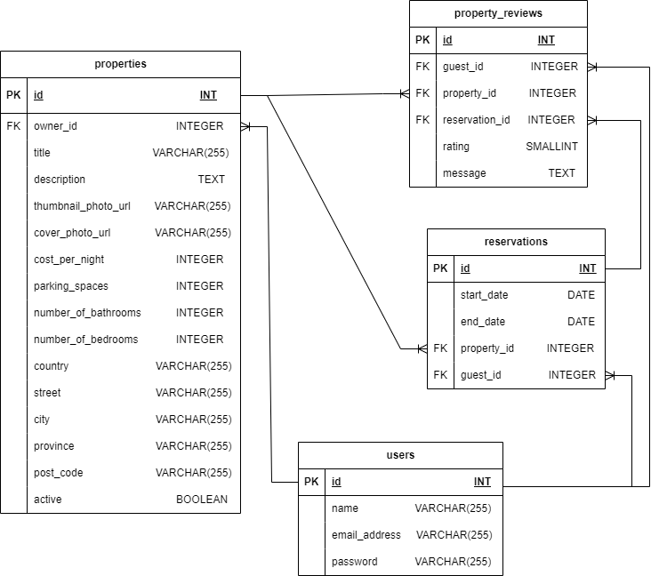
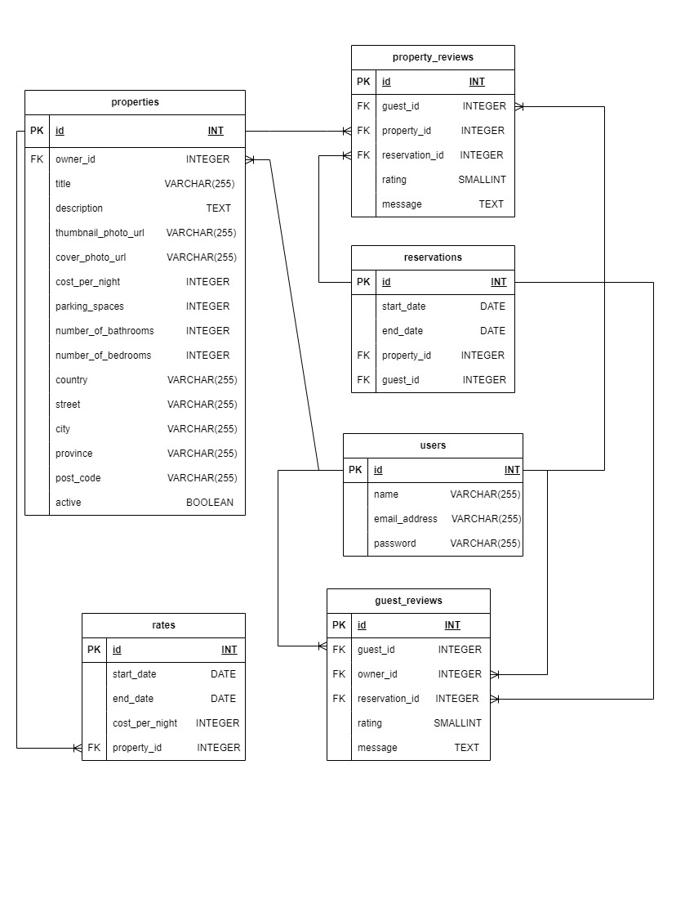

# LightBnB Project

## About
Lighthouse BnB is a vacation rental app that allows homeowners to rent out their properties to travelers, offering an alternative to traditional hotels and bed and breakfasts. Users can view property information, book reservations, manage their reservations, and provide feedback through reviews.

## Purpose
The purpose of this project is to design a database and use server-side JavaScript to display the information from queries to web pages. And it requries to apply existing knowledge of complex SQL queries, database and ERD (entity relationship diagram) design to integrate the database with a Node backend.

## Database Design

The Lighthouse BnB app uses a relational database to manage its data, consisting of several key entities: users, properties, reservations, and property reviews. The relationships between these entities are described below.

### User Entity
A user is a registered individual who interacts with the app. Each user has the following attributes:

- Name
- Email address
- Password

### Property Entity
A property represents a place that can be rented out. It contains the following attributes:

- Title
- Description
- Cost per night
- Parking spaces
- Number of bathrooms
- Number of bedrooms
- Active status (whether the property is currently available for rent or not)

Additionally, a property has associated images with:

- Thumbnail photo URL
- Large cover photo URL

The property's address data includes:

- Country
- Street
- City
- Province
- Postal code

Each property is owned by a registered user. Therefore, a property has a relationship with the user entity, where it belongs to one owner.

### Reservation Entity
A reservation represents a booking made by a user for a specific property. It includes:

- Start date
- End date

Each reservation is associated with a specific guest, who is a registered user. Therefore, a reservation has a relationship with the user entity, where it belongs to one guest.

### Property Review Entity
A property review consists of:

- Message
- Rating (1 to 5)
A property review is made by a guest who has previously made a reservation for a specific property. Thus, a property review is associated with a reservation.

### Entity Relationships
- A user can own many properties (one-to-many relationship).
- A property belongs to one owner (one-to-one relationship).
- A user can make many reservations (one-to-many relationship).
- A reservation belongs to one guest (one-to-one relationship).
- A property can be reviewed by many guests (one-to-many relationship).

This database design ensures effective management of user information, property details, reservations, and property reviews, enabling the Lighthouse BnB app to provide a seamless experience for both property owners and travelers.

### Extended ERD
Here is the extended Entity Relationship Diagram (ERD) for the Lighthouse BnB app, showcasing the new tables added to meet the growing requirements:

### Rates Entity
The Rates table captures the different rates set by property owners for specific date ranges.

- rate_id
- property_id 
- start_date 
- end_date 
- nightly_rate

### Guest Reviews Entity
The Guest Reviews table enables property owners to leave reviews about guests who have stayed at their properties.

- review_id 
- property_id
- reservation_id
- rating (1 to 5).
- review_message: The review message left by the owner.